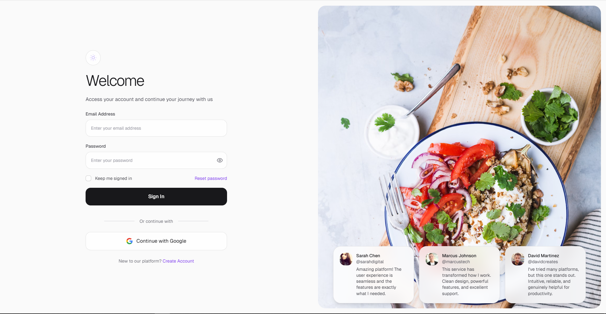

<h1 align="center">
    AWESOME LOGIN WEB
</h1>

    
    
    
    
    
    

### ✍️ Description

A collection of sleek, modern, and customizable login page templates built with HTML, CSS And Javascript. Perfect for developers who want clean and functional authentication pages.

### 🌟 Features

- Fully responsive design  
- Modern UI/UX patterns  
- Multiple login variations (classic, social, modal)  
- Easy to customize  

### 🌐 Live Demo

Check out the templates live on [GitHub Pages](https://<username>.github.io/awesome-login-web/).

### 👤 Author

**Damartripamungkas** – [GitHub Profile](https://github.com/damartripamungkas)  
Feel free to connect and collaborate!

### 📄 License

MIT License. See the [LICENSE](LICENSE) file for details.
