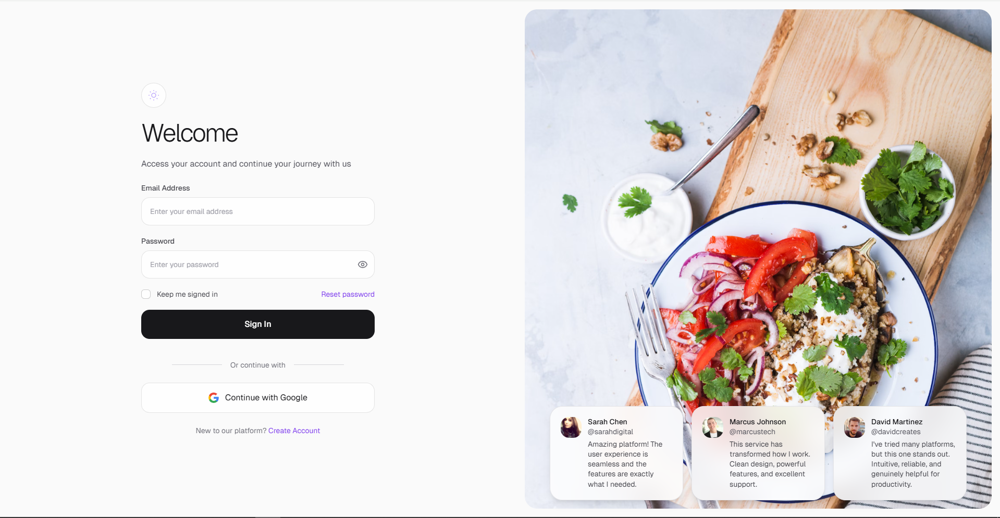

<h1 align="center">
  ✨ AWESOME LOGIN WEB
</h1>

<p align="center">
  A curated collection of sleek, modern, and fully customizable login page templates — built with pure HTML, CSS, and JavaScript.
</p>

<p align="center">
  
  
  
  
  
</p>

<p align="center">
  
  
  
</p>

<br>

<p align="center">
  
</p>

---

## ✍️ Description

**Awesome Login Web** is an open-source collection of beautifully designed login page templates. Whether you need a classic form, a social login, or a full-page immersive experience — this collection has you covered. Each template is handcrafted with attention to detail, responsive layouts, and real-world usability in mind.

Perfect for developers, designers, and indie makers who want clean, polished, and production-ready authentication pages without starting from scratch.

---

## 🌟 Features

- 📱 **Fully responsive** — looks great on all screen sizes
- 🎨 **Modern UI/UX patterns** — clean, minimal, and professional
- 🔁 **Multiple variations** — classic form, social login, modal, food-themed, and more
- ⚡ **Zero dependencies** — pure HTML, CSS, and JavaScript (some use Tailwind CDN)
- 🛠️ **Easy to customize** — well-structured code with clear class naming
- 🌙 **Light & dark variants** — templates available in multiple color themes

---

## 🌐 Live Demos

Browse all templates on the live GitHub Pages site, or jump straight to a specific one below:

| # | Template Name | Preview |
|---|---------------|---------|
| 1 | 🍔 Food Bright | [View Live →](https://damartripamungkas.github.io/awesome-login-web/login-food-bright.html) |

> More templates coming soon! Contributions are welcome — see [Contributing](#-contributing) below.

---

## 📁 Project Structure

```
awesome-login-web/
├── screenshots/          # Preview images for each template
├── login-food-bright.html
└── ... (more templates)
```

---

## 🚀 Getting Started

1. **Clone the repository**
   ```bash
   git clone https://github.com/damartripamungkas/awesome-login-web.git
   ```

2. **Open any template directly in your browser**
   ```bash
   cd awesome-login-web
   open login-food-bright.html
   ```

3. **Customize** the HTML/CSS to match your project's branding and backend.

No build step. No dependencies to install. Just open and go.

---

## 🤝 Contributing

Contributions are warmly welcome! If you've built a login page design you're proud of:

1. Fork this repository
2. Add your `.html` file to the root directory
3. Add a screenshot to `screenshots/`
4. Update the Live Demos table in this README
5. Open a Pull Request with a short description

Please make sure your template is responsive and uses clean, readable code.

---

## 👤 Author

**Damartripamungkas**
- GitHub: [@damartripamungkas](https://github.com/damartripamungkas)

Feel free to connect, open issues, or collaborate on new templates!

---

## 📄 License

This project is licensed under the **MIT License** — see the [LICENSE](LICENSE) file for details.

You're free to use, modify, and distribute any template in this collection, even for commercial projects.

---

<p align="center">
  If you find this helpful, please consider giving it a ⭐ on GitHub — it really helps!
</p>
